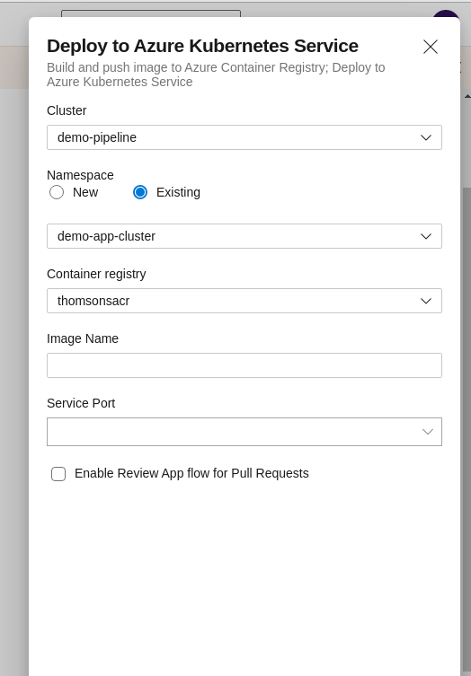

# Demo Pipeline for Azure Pipelines

## Azure DevOps Organisation

By creating an Azure DevOps organisation with an account in an Azure Active Directory
with an existing Azure subscription,
it is easy to set up pipelines that would be dependent on (the creation of)
Azure infrastructure for their deployments.

## Repository

The repository could be hosted in DevOps,
but for the first time I opted to use an external GitHub repository.
I don't really notice performance problems.

## Pipeline creation

The file `azure-pipelines.yml` contains the pipeline definition.
A pipeline is configured in [https://dev.azure.com/scottthomson/build-pipeline-demo]
that uses this YAML file for configuration.

The pipeline was created by selecting 'Deploy to Azure Kubernetes Service'
as a base pipeline:

The result is a pre-prepared YAML pipeline.

The wizard connects to Azure using the current Azure DevOps user account
and so requires a certain number of permissions in Azure itself.
The wizard creates certain resources,
such as a service principal in Azure
with rights to push to the Azure Container Registry.
The pipeline itself creates other resources,
such as image pull secrets
with which to pull images from Docker into the Kubernetes cluster.

An AKS service/cluster and Azure Container Registry was set up manually before starting,
although another pipeline could in principle be used to deploy this if it does not exist.
(E.g., deploying a set of YAML files would be one possibility.)

In principle the YAML could be directly re-used,
but only when re-creating these necessary resources.

## Pipeline description

The pipeline has the following steps under its build stage:

- Gradle build (Jar output), which also creates coverage reports;
- SonarCloud code scan (URL for the dashboard appears in the log output);
- A script to save the commit ID to a pipeline variable;
- A docker image build that sets the commit ID in the container;
- A step to push the image to the Azure Container Registry;

In the deploy stage:

- A step to deploy the Kubernetes manifests,
  so deploying the pods and creating the services.

### CI/CD Triggers

A trigger is set so that new commits on `master` activate the pipeline,
thus deploying the latest state of master to Kubernetes.
I haven't noticed any significant delays in this trigger being activated from GitHub
 instead of a DevOps-hosted repository,

## Application

The application is a small Spring application that runs on port 8080.
In Kubernetes it is accessible on port 80 via the cluster IP.
This can be found in the Azure portal.
The external IP is output in the deploy stage logs.

## Useful features

### Test results and test coverage

One can check the test results and code coverage by looking at a run summary for the pipeline.
(**TODO**: Code coverage in Sonar is not yet correctly set up.)

### Deploy pull request

I haven't had the chance to look at this yet.

## Gotchas

### Pipeline/stage variables

In order to set a variable that is accessible to the rest of the stage
(from within a script)
one must print it using a special syntax:
`echo "##vso[task.setvariable variable=THE_COMMIT_ID]$COMMIT_ID"`
The variable `THE_COMMIT_ID` can then be used elsewhere in the pipeline
as `$(THE_COMMIT_ID)`.

